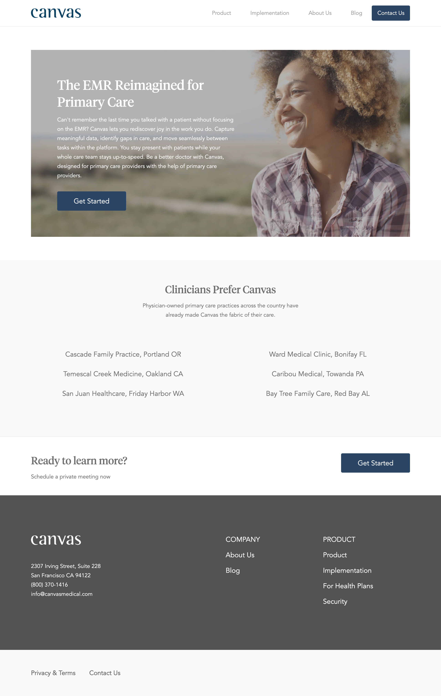

# css-canvas-medical

Using HTML and CSS to build a web page from scratch.

## Before You Begin

Be sure to check out a new branch from `main` for this exercise. Detailed instructions can be found [**here**](../../guides/starting-an-exercise).

## Challenge

**A common job interview challenge is being being asked to build a webpage using HTML, CSS, a few images, and nothing but a PDF or Photoshop reference image.**

For this challenge, you will be using HTML and CSS to build a custom web page from scratch. Your implementation doesn't have to look absolutely identical to the reference image, but get as close as you can. It should be challenging to notice any differences. Some fonts and starter code have been included to help you begin.

Complete `index.html` and `styles.css` to create a page that looks as close to the following provided `example.png`. You should not need to modify any of the other files.

  

### Workflow

It is recommended that you build your implementation side-by-side with the reference image. Use your browser's developer tools to inspect elements and experiment with styles as you go.

Work on the web page section-by-section and make a commit as you complete each section.

## Submitting Your Solution

When your solution is complete, submit a Pull Request on GitHub. Detailed instructions can be found [**here**](../../guides/submitting-your-solution).

## Extra Practice (on your own time)

When you have completed and turned in the initial Canvas Medical page, you should plan on spending some additional time working through the rest of the pages in the site (in separate HTML documents). Reference images of the complete pages are provided in `additional-examples`.

### `product.html`

  

### `implementation.html`

  

### `about-us.html`

  

### `blog.html`

  

### `contact-us.html`

  

